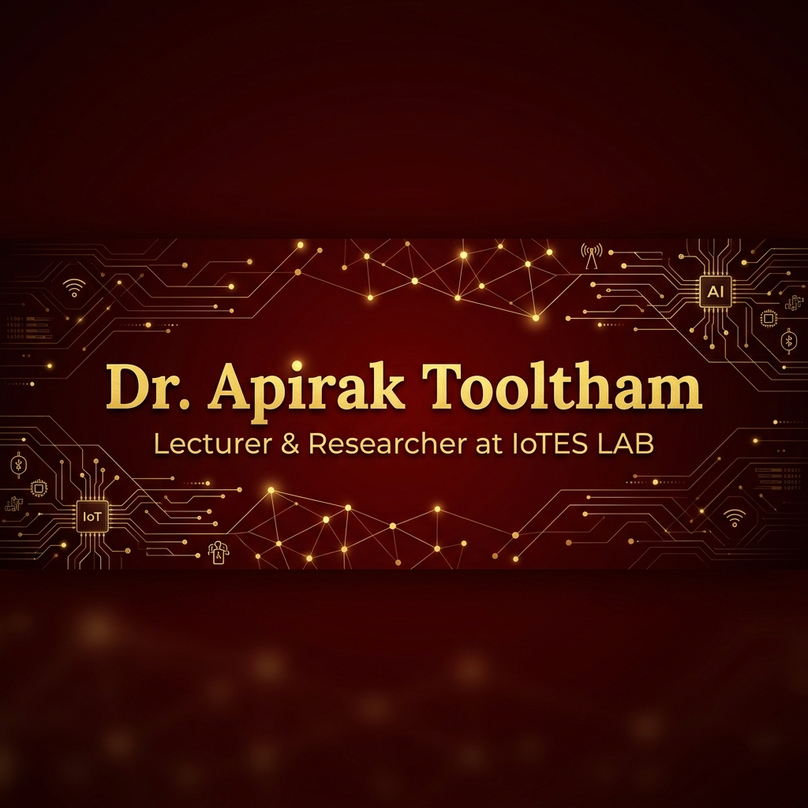
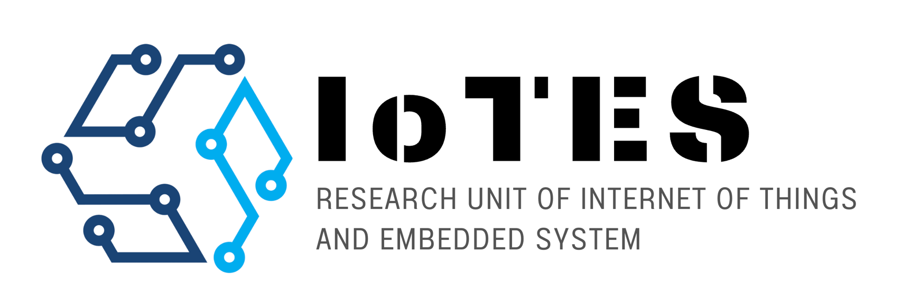

  

 

# 👋 สวัสดีครับ! ผม ดร. อภิรักษ์ ทูลธรรม (Dr. Apirak Tooltham)

  <b>Lecturer • Researcher • Programmer • Tech Enthusiast</b>

---

### 🏛️ About Me
ผมเป็นอาจารย์และนักวิจัยประจำหน่วยวิจัย **IoTES LAB** (Research Unit of Internet of Things and Embedded System) คณะศิลปศาสตร์และวิทยาศาสตร์ **มหาวิทยาลัยนครพนม (NPU)**

ผมมีความเชี่ยวชาญด้านการพัฒนาเทคโนโลยี และมีความหลงใหลในโลกของ Coding รวมถึงการวิจัยในหัวข้อที่ทันสมัย เพื่อสร้างนวัตกรรมที่ตอบโจทย์สังคม

- 📍 Location: Nakhon Phanom, Thailand
- 🏢 Lab: [IoTES LAB](https://iotes-sitc.npu.ac.th/)
- ☕ Passion: Love Coffee & Coding

---

### 🔬 Research & Expertise
งานวิจัยและทักษะทางเทคนิคที่ผมให้ความสนใจ:

- **IoT & Embedded Systems**: พัฒนาระบบอัจฉริยะและการเชื่อมต่อ
- **Artificial Intelligence & Image Processing**: การวิเคราะห์ข้อมูลและการมองเห็นของคอมพิวเตอร์
- **Data Science & Digital Marketing**: การใช้ข้อมูลเพื่อขับเคลื่อนกลยุทธ์และนวัตกรรม
- **Programming Languages**:
   
  

---

### 📊 GitHub Statistics

  
  

---

### 🎨 Personal Interests & Hobbies
นอกจากเรื่องงานแล้ว ผมยังมีความสนใจในด้านศิลปะและไลฟ์สไตล์ที่หลากหลาย:
- 📸 **Photography & Urban Sketching**: บันทึกความงามผ่านเลนส์และปลายปากกา
- 📚 **Books, Manga & Game Consoles**: พักผ่อนไปกับโลกแห่งจินตนาการและการเล่นเกม
- ☕ **Lifestyle**: หลงรักในรสชาติของกาแฟและการทดลองสิ่งใหม่ๆ

---

  
   
  <i>"Empowering Future with IoT and Intelligent Systems"</i>

  

